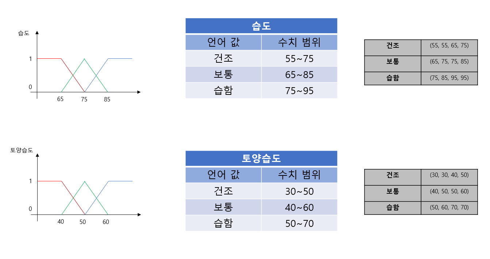
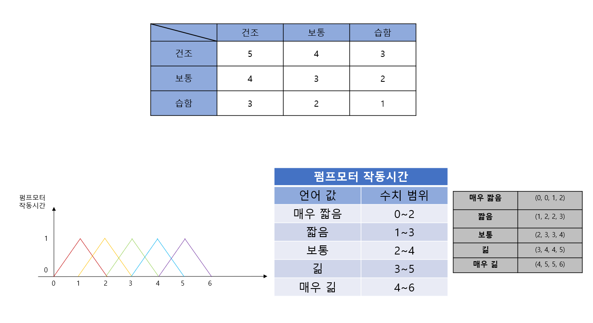
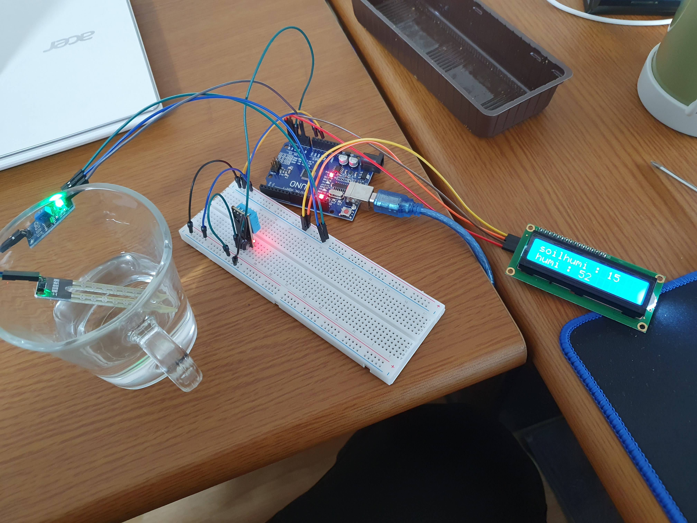

아두이노 프로젝트
==
## 개요
아두이노를 이용한 스마트 화분
+ 화분의 토양수분과 습도를 측정해 퍼지화를 시켜 화분에 주는 물의 양을 결정
+ 토양의 수분과 습도를 LCD에 출력
---
## 자료수집
+ 오전 특정한 시각을 기준으로 물을 한번 줌
+ 토양 습도는 40~60%가 적당
+ 공기 중 습도는 70~80%가 적당
+ 공기 중 온도는 15~27도가 적당
---
## 퍼지




---
## 준비물
토양수분센서 1개  
LCD 1개  
온습도센서 1개  
브레드보드 1개  
아두이노 우노보드 1개
펌프 모터 1개
실리콘 파이프 1개

---
## 코드
```
#include <DHT11.h>
#include <LiquidCrystal_I2C.h>
#include <Wire.h>

LiquidCrystal_I2C lcd(0x27, 16, 2);

int soil = A1;
int dht = A3;
float humi, temp;
int i;
DHT11 dht11(dht);
void setup(){
  Serial.begin(9600);
  lcd.init();
  lcd.clear();
  lcd.backlight();
}

void loop(){
  int soil_valueper = map(analogRead(soil), 0, 1024, 100, 0);
  dht11.read(humi, temp);
  delay(1000);
  lcd.setCursor(0, 0);
  lcd.print("soilhumi : ");
  lcd.setCursor(0, 1);
  lcd.print("humi : ");
  lcd.setCursor(11, 0);
  lcd.print(soil_valueper);
  lcd.setCursor(7, 1);
  lcd.print((int)humi);
}
```
---
## 사진
